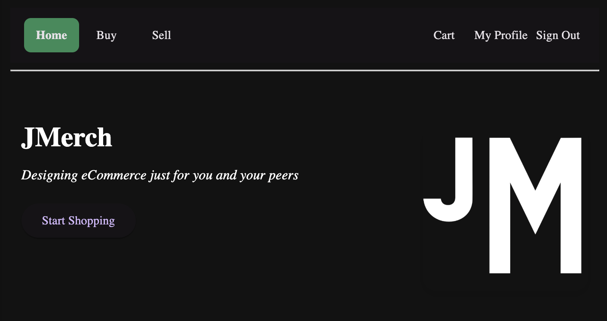
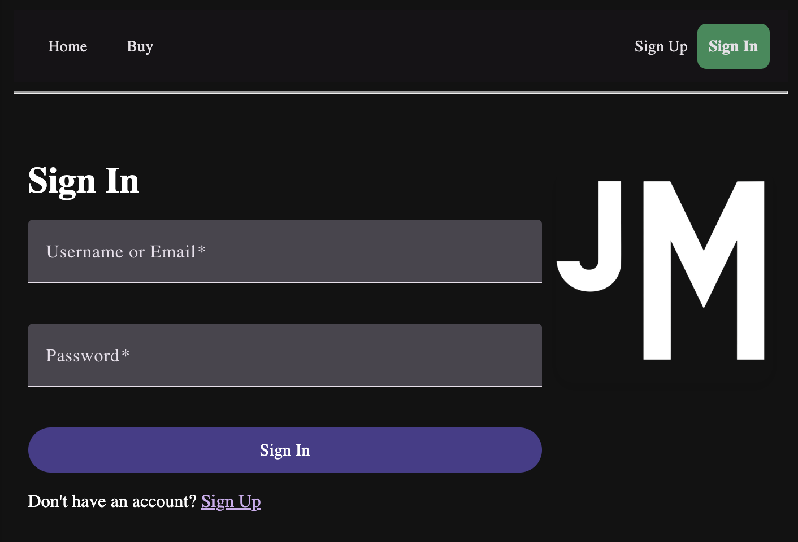
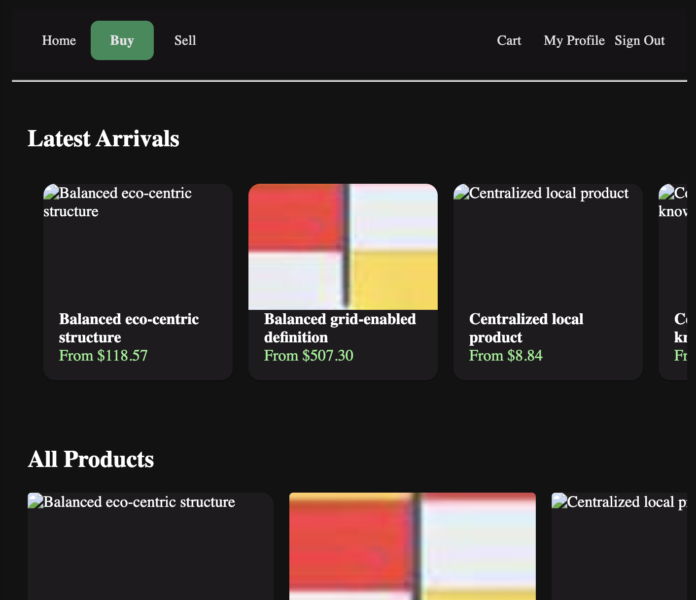
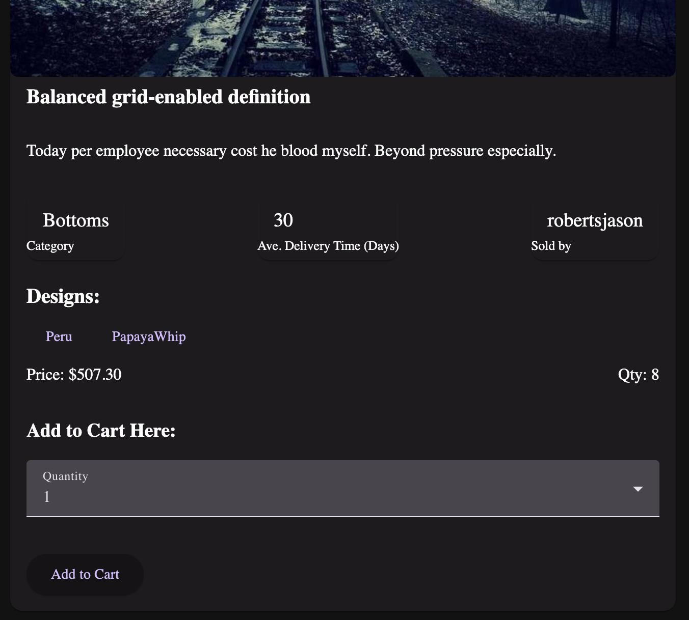
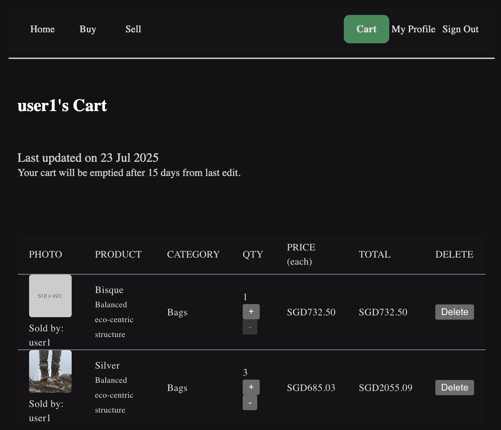

# JMerch

Still learning on Flask & Angular in separate learner files (commits may be slow)

Full Stack

- Angular
- SCSS
- Python Flask
- PostgreSQL

- [Content](#content-&-features)
- [Application Photos](#screengrabs-of-application)
- [Challenges](#Technical-Obstacles)

## Content

### User Stories

#### As a user:

- [x] As a user, I want to see different products that are available on the web application
- [x] As a user, I want to be able to sign up for an account if I dont already have one to use more features in the web application
- [x] As a user, I want to be able to sign into my account if I already have one use more features in the web application
- [x] As a user in my account, I want to be able to view my profile details
- [ ] As a user in my account, I want to be able to edit my account details if I need to change them
- [ ] As a user in my account, I want to be able to change my account password
- [ ] As a user in my account, I can be a buyer or a seller of products:

#### As a buyer:

- [ ] As a buyer, I want to be able to select products allocated in one of the pre-defined categories to narrow down my search
- [ ] As a buyer, I want to be able to search for products by name or user (or description) to find the product I am looking for
- [ ] As a buyer, I want to be able to see what a particular other user is selling to understand their product line
- [x] As a buyer, I want to be able to see all product's price, variation, available quantity at a quick glance
- [ ] As a buyer, I want to be able to see more details of any particular product to know the prices and available quantities of the different designs
- [x] As a buyer, I want to be able to add a particular items to may cart
- [ ] As a buyer, I want the information in my cart to be stored for at least a few weeks in order to allow me to revisit my purchases at a later time
- [ ] ? As a buyer, I want to be able to check out my cart and confirm my delivery address to ensure correct delivery of products to me
- [ ] ? As a buyer, I want to be able to see my previous orders to understand my shopping history
- [ ] ? As a buyer, I want to be able to see existing uncompleted orders and their delivery status to manage my expectations of the delivery timeline

#### As a seller:

- [ ] As a seller, I want to be able to add products to be sold
- [ ] As a seller, I want to be able to edit product details to better inform the seller of the product
- [ ] As a seller, I want to be able to disable selling of a product to handle my orders
- [ ] ? As a seller in my product page, I want to be able to see a list of usernames
- [ ] ? As a seller in my product page, I want to be able to select who can see my product should I restrict who can see the item <New Users can see something different features (discount? Tutorial)?>
- [ ] As a seller, I want to be able to add product designs to be sold
- [ ] As a seller, I want to be able to edit product design details - inventory quantities, price, and design - in order to manage my product line and shop
- [ ] ? As a seller, I want to be able to see the previous orders to my products to understand my store's history
- [ ] ? As a seller, I want to be able to see the existing uncompleted orders to my store and products in order to handle the product delivery timelines.
- [ ] ? As a seller, I want to be informed of when certain product inventories are (user-defined) low in order to better manage my inventory

## Screengrabs-Of-Application

---- Home Page

---- Sign Up Page

---- Product Page

---- One Product Page

---- Cart Page

## Technical Obstacles

### Theories Learnt/Applied

Backend Flask Techniques:

- [x] [Modular Blueprints Video](https://www.youtube.com/watch?v=pjVhrIJFUEs)
  - [x] [Modular Blueprints](https://flask.palletsprojects.com/en/stable/blueprints/)
- [x] [Error Handling](https://flask.palletsprojects.com/en/stable/api/#flask.Flask.errorhandler)
- [x] Connection & Cursor Handling
- [x] [Faker Creation](https://faker.readthedocs.io/en/master/providers/faker.providers.profile.html)
- [x] Marshmallow validating (Minor)
- [ ] Separate Project - FastAPI (Pydantic) & SQLAlchemy

Database PostgreSQL Techniques:

- [x] [LIKE & POSIX operator for PostgreSQL](https://www.postgresql.org/docs/current/functions-matching.html)
- [x] [NOT NULL vs DEFAULT usage]
- [x] [ON DELETE CASCADE](https://neon.com/postgresql/postgresql-tutorial/postgresql-delete-cascade)
- [ ] [UUID usage]
- [ ] [Use PATCH instead of PUT]

Frontend Angular Techniques:

- [x] [AnalogJS set up](https://www.npmjs.com/package/@analogjs/vite-plugin-angular)
- [x] [Routing ](https://www.youtube.com/watch?v=BUDQTd1DQAg)
- [x] [Routing - Active Link](https://angular.dev/api/router/RouterLinkActive)
- [x] [Angular Material](https://material.angular.dev/guide/theming)
- [x] [Form Creation](https://www.youtube.com/watch?v=U9Xo0wXZIAg)
- [x] [Form Validation](https://angular.dev/api/forms/FormControl)
- [x] [Angular Material - Form Module](https://material.angular.dev/components/form-field/overview)
- [x] [Form Cross-Field Validation](https://angular.dev/guide/forms/form-validation#cross-field-validation)
- [x] [Authentication - Service for SignUp/SignIn](https://medium.com/@matheusluna96/authentication-and-authorization-in-angular-0697ab16e465)
- [x] [Authentication - Interceptor for Bearer Token](https://medium.com/@matheusluna96/authentication-and-authorization-in-angular-0697ab16e465)
- [x] [Angular Material - SnackBar/Toasts](https://material.angular.dev/components/snack-bar/overview)
- [x] [Reusable SnackBar](https://stackoverflow.com/questions/42761039/how-to-use-snackbar-on-service-to-use-in-every-component-in-angular-2)
- [x] [Authorization - Private Routing Role Guards](https://medium.com/@matheusluna96/authentication-and-authorization-in-angular-0697ab16e465)
- [x] [Fetching](https://www.google.com/search?q=angular+fetching+service&oq=angular+fetching+service&gs_lcrp=EgZjaHJvbWUyBggAEEUYOTIICAEQABgWGB4yCAgCEAAYFhgeMg0IAxAAGIYDGIAEGIoFMgcIBBAAGO8FMgoIBRAAGIAEGKIE0gEIMjgyMmowajeoAgCwAgA&sourceid=chrome&ie=UTF-8)
- [ ] [Pipes]
- [ ] [Better Grasp of Observables]

### Challenges

Backend Techniques

- NOT NULL vs DEFAULT
- strings vs int for IDs :\
- Difficulty handling NULL data when importing
- formatting of Python not supported by Prettier
- Handling of SQL as strings.... (I guess Spell Checker helps)
  - Feels very manual
- Non-chaining format of Python Flask
- Translating camelCase to snake_case to PostgreSQL

Frontend Techniques

- SO MANY FILES
- Handling of Null types Javascript vs Python
- Component & Data Binding a bit difficult to conceptualise/visualise
- Strict Typing when modularising components (more for Forms) - i.e. the typing differences of Typescript & Angular are not apparent
- 2 layers of imports, Standalone Modules requiring imports of import
